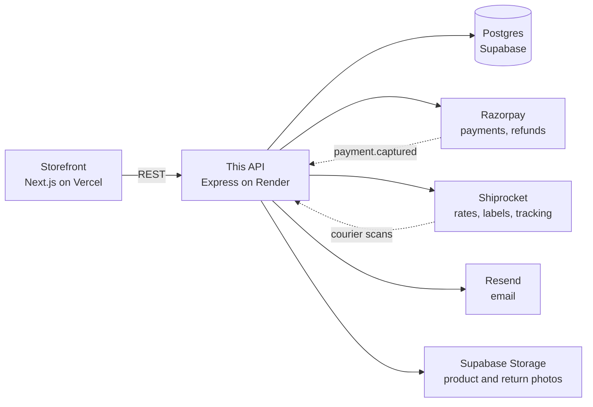

# Shukarsh Backend

The API behind the Shukarsh store: catalogue, checkout, payments, courier
booking, returns and reviews. Express and TypeScript, Prisma over Postgres.



The dotted arrows arrive on their own, and they are why the shop still works when
a customer closes the tab mid-payment or a parcel is delivered at 6am on a Sunday.
Everything except Postgres is optional: with no Razorpay, Shiprocket, Resend or
Supabase keys the store still runs, and each feature switches itself off rather
than erroring.

### Where to look

| If you want to | Go to |
| --- | --- |
| Run it on your machine | [Getting started](#getting-started) |
| Know what a setting does | [Settings](#settings) |
| Deploy it, or change the database | [Deployment](#deployment) · [Schema changes](#schema-changes) |
| Understand what happens after "Pay" | [An order's life](#an-orders-life) |
| Charge tax, or run a discount | [GST](#gst) · [Coupons](#coupons) |
| Send something back | [Returns](#returns) |
| Count what is on the shelf | [Stock](#stock) |
| Get a parcel to a customer | [What delivery costs](#what-delivery-costs-the-customer) · [Shiprocket](#shiprocket) |

## Getting Started

1. Install dependencies:
   ```bash
   npm install
   ```

2. Copy the environment file and fill in your values:
   ```bash
   cp .env.example .env
   ```

3. Set up the database:
   ```bash
   npx prisma migrate dev --name init
   ```

4. (Optional) Seed sample data:
   ```bash
   npx prisma db seed
   ```

5. Run the development server:
   ```bash
   npm run dev
   ```

The API will be available at `http://localhost:5000`.

## Scripts

- `npm run dev` — Start development server with hot reload
- `npm run build` — Compile TypeScript
- `npm run start` — Start production server
- `npm run lint` — ESLint over the whole repo
- `npm run check:tax` — Assert the GST, discount, delivery and refund arithmetic
- `npm run rates:survey` — Quote real courier rates across India (needs Shiprocket credentials)
- `npm run db:migrate` — Run Prisma migrations
- `npm run db:studio` — Open Prisma Studio

## Deployment

### Supabase Database

1. Create a free project at [supabase.com](https://supabase.com).
2. Go to Settings > Database > Connection string.
3. Copy the **URI** connection string.
4. Set it as `DATABASE_URL` in Render and locally.

### Schema changes

Migrations live in `prisma/migrations` and are committed. `prisma migrate deploy`
runs from the `prestart` script, so it happens on the way up no matter how the
host's build command is configured. That is deliberate: `render.yaml` also puts
it in `buildCommand`, but a service set up by hand in the Render dashboard does
not use the blueprint, and the schema silently not migrating is how you end up
with new code live against an old database. Running it twice costs nothing,
because applying an already-applied migration is a no-op.

A failed migration therefore stops the server from starting. That is the point:
refusing to boot is easier to spot and to fix than booting and throwing P2022 on
every request that touches the changed table.

Never use `prisma db push` against production: it changes the database without
recording a migration, and the next deploy will not know what has already been
applied.

To change the schema, edit `prisma/schema.prisma`, then:

```bash
npx prisma migrate dev --name what_changed
```

Commit the generated folder under `prisma/migrations` along with the schema.

### Render

1. Push this repo to GitHub.
2. In Render, click **New Web Service** and connect this repo.
3. Use the `render.yaml` blueprint or configure manually:
   - Build command: `npm install; npm run build`
   - Start command: `npm run start`
4. Add environment variables:
   - `DATABASE_URL` (from Supabase)
   - `JWT_SECRET` (random string)
   - `RAZORPAY_KEY_ID` (from Razorpay)
   - `RAZORPAY_KEY_SECRET` (from Razorpay)
   - `FRONTEND_URL` (your Vercel frontend URL)
   - `CORS_ORIGIN` (your Vercel frontend URL)

### Razorpay

1. Create a Razorpay account at [razorpay.com](https://razorpay.com).
2. Get your test key id and key secret from the dashboard.
3. Set `RAZORPAY_KEY_ID` and `RAZORPAY_KEY_SECRET` in your environment variables.
4. Use Razorpay test cards for testing, e.g., `5267 3181 8797 5449`.

#### Payment webhook

Set this up. The browser calls `/api/orders/verify` after a successful payment,
but that call never happens if the customer closes the tab, loses signal or the
page crashes in that moment. Razorpay would have taken the money while the order
sat on `PENDING` with stock never decremented.

1. Razorpay dashboard > **Settings > Webhooks > Add New Webhook**.
2. URL: `https://your-api-host/api/orders/webhook`
3. Secret: any long random string, also set as `RAZORPAY_WEBHOOK_SECRET`.
4. Subscribe to **payment.captured**.

Both paths converge on the same conditional update, so whichever arrives second
sees the order already paid and skips the stock decrement rather than running it
twice.

### GST

Listed prices are the MRP: the tax is already inside them. Nothing here changes
what a customer is charged, it decides how the tax already in the total gets
reported on the order, the receipt and the invoice.

`SELLER_STATE` is what splits CGST+SGST (buyer in your state) from IGST (buyer
anywhere else), so GST stays switched off until you set it. That is the right
setting until you have a GSTIN, because charging GST without one is not legal.

Each product carries its own `gstRate`, picked from the real slabs (0, 0.25, 3,
5, 12, 18, 28). New products fall back to `GST_DEFAULT_RATE`. Delivery is part
of a composite supply, so it is taxed at the rate of the highest-value item in
the order unless you set `GST_ON_SHIPPING=false`.

Every order stores its own tax breakdown and the rate that applied to each line
at the time. Slabs change and customers move house, and neither should be able
to rewrite an invoice that has already gone out. `placeOfSupply` is kept for the
same reason: GSTR-1 is filed state-wise.

`POST /api/orders/quote` prices a bag without writing anything down. The
checkout page uses it so the GST it shows comes from the same code that charges
the card.

Shiprocket is sent `tax: 0` on every line on purpose. Our `selling_price` is
already inclusive, and Shiprocket adds `tax` on top when it prints an invoice,
so any other value bills the customer's GST to them twice.

### Coupons

Managed under **Admin > Coupons**. Three kinds: a percent off (optionally
capped), a flat amount off, or free shipping. Each code can carry a minimum
spend, a total usage limit, a per-customer limit, a live window, and a
first-order-only flag.

Leave a code's categories empty and it covers the whole catalogue. Attach
categories or products and only those lines are discounted, so "25% off
dresses" leaves the rest of the bag alone. The minimum spend is then measured
against the covered lines rather than the whole bag, which is the reading a
customer expects.

A discount is split across the lines it covers in proportion to what each is
worth. That is not cosmetic: GST is charged per line at that line's own rate, so
which lines the money comes off changes what is owed. The discount is applied
before tax is worked out, because GST is due on what the customer actually pays.

Redemptions are booked when an order is confirmed, not when it is placed, so an
abandoned checkout never eats into a code's total count. The count is incremented
unconditionally at that point: by then the money has been taken, and refusing to
record it would leave a discount charged but unaccounted for.

The per-customer limit counts orders that are still awaiting payment as well as
recorded redemptions. Without that, five unpaid checkouts each carrying a
one-per-person code can all be paid afterwards and the code has been used five
times.

So that an abandoned checkout does not sit on the customer's one use forever, an
unpaid order is cancelled after `ABANDONED_ORDER_HOURS` (24 by default) and a
cancelled order lets go of its code. That sweep runs hourly in process and again
on `POST /api/logistics/sync`, which is the clock a host that sleeps actually
has. Only orders Razorpay never named a payment against are touched.

Halfway through that window, the same sweep sends one recovery email per order
and never a second, recorded on `Order.recoveryEmailAt`. It is skipped for a
customer who has paid for anything since, because a card that fails once often
succeeds on the retry and that customer has not forgotten anything.

The link in it carries an HMAC of the order id, so it works without signing in
and cannot be made up from an order id alone. `GET /api/orders/:id/recover`
returns nothing but the products and quantities, and only those still on sale.
The bag lives in the customer's browser, so the link rebuilds it rather than
reviving the old checkout: prices, stock, delivery and coupons are all worked out
again at the till.

`usageLimit` is enforced where it can still be honoured, when the code is applied
and again before payment starts, so a busy limited code can overshoot its cap by
a use or two under concurrent checkouts.

Deleting a code that has been used switches it off instead. Redemptions are what
evidences an order's discount, and deleting the coupon would cascade them away.

`POST /api/coupons/apply` checks a code against a real bag and is what the
checkout page calls. It runs the whole quote rather than reading the coupon on
its own, so the figure it reports is the figure that will be charged.

### Email

Order confirmations and dispatch notices go out through
[Resend](https://resend.com) over its REST API, so there is no SDK to install.
Set `RESEND_API_KEY` and `EMAIL_FROM` (a sender on a domain you have verified
with Resend). Leave them unset and the store behaves exactly as before, just
without email. A send that fails is logged and never blocks a payment or a
shipment.

### Accounts

One address is one account, however it was typed. Every route that takes an email
parses it through `emailField`, which trims and lowercases before it validates,
so what gets stored is what the next sign-in will search for. Sign-in used to
compare addresses exactly, which made `Priya@gmail.com` and `priya@gmail.com` two
people with their orders split between them.

The migration lowercased every address that could be lowercased without landing
on another row, and deliberately stopped at pairs that differ only by case, since
merging two accounts means choosing whose orders and whose password survive.
`npm run check:emails` lists any that are left, with order counts to show which
one is the real one. Sign-in still reaches those rows by falling back to a
case-insensitive lookup, oldest first, and quietly rewrites the address to
lowercase once its owner has proved it is theirs.

Once `check:emails` reports nothing, a unique index on `lower("email")` should be
added to make the rule structural. It is not there yet because creating it fails
if any duplicate still exists, and a failed migration is a failed deploy.

### Stock

`Product.stock` is still the number that decides whether something can be sold,
because the conditional decrement on it is what stops two people being sold the
same last item. Beside it, `StockMove` records every movement and why: a sale, a
cancellation, a reopened order, a resellable return, a delivery arriving, a
recount, a write-off. Everything goes through `moveStock()` in
`src/lib/inventory.ts`, in the same transaction as whatever caused it, so the
shelf and the reason for it can never disagree.

Adjustments from the admin panel post a difference rather than a total. A form
that posts "there are now 12" throws away any sale that happened while it was
open; `POST /api/products/:id/stock` takes `delta` and cannot. The product form
still accepts an absolute number, and records the difference as a recount.

`npm run check:stock` compares every product against the sum of its ledger and
exits non-zero on any disagreement. It needs a database, so it is a diagnostic
rather than part of the build. Products that existed before the ledger were given
an opening balance by its migration, so the sums start out true.

Each product carries its own `lowStockThreshold` (5 by default). Anything at or
below it counts as needing a reorder, which drives the badge in the catalogue, the
dashboard count, the "only a few left" line on the storefront, and a digest email
sent once a day at `LOW_STOCK_DIGEST_HOUR` (9am IST). The day it last ran is kept
in `SystemFlag`, so a host that redeploys or wakes from sleep does not send the
same list four times.

### Returns

A customer can open a return from their own order page for
`RETURN_WINDOW_DAYS` (7 by default) after delivery, which is counted from
`Order.deliveredAt`, written the first time an order is seen delivered and never
moved after that. Only two reasons are accepted, damaged and wrong item: nails
and kitchen pieces cannot be resold once opened, so change of mind is not
offered. Orders delivered before that column existed have no date to count from
and are handed to a human rather than refused.

A damage claim has to come with a photo, since it cannot be judged without one.
Customers upload through `POST /api/uploads/returns`, which needs a signed-in
account rather than an admin, is rate limited by `RATE_LIMIT_UPLOAD_MAX`, and
stores under a `returns/` prefix in the same Supabase bucket. What comes back on
the request is checked against that prefix on the way in: the browser decides
what to send, so a URL is not evidence until we know we are hosting it. There is
no customer-facing delete, so nothing can vanish mid-decision.

The request lands in `/admin/returns`, where it is approved or refused with a
note the customer is emailed word for word. What it is worth is apportioned from
what was actually paid, not from the sticker price: `OrderItem.taxableAmount +
taxAmount` is the line net of its share of any coupon, so a bag with ₹300 off
does not refund a third of that discount twice. Delivery is only refunded when
nothing is being kept. `npm run check:tax` asserts all of it.

Marking the parcel received asks per item whether it can be sold again, and only
those units go back into stock. A return covering every unit of the order also
moves the order itself to Returned.

Once the parcel is back, one button in the queue sends the money: `POST
/api/returns/:id/refund` refunds the frozen `refundAmount` against the order's
Razorpay payment at normal speed, which is free and takes five to seven working
days. It is a separate action rather than part of closing the return, so nothing
leaves the account by accident.

Pressing it twice cannot pay twice. The return's id is sent as
`X-Refund-Idempotency`, so Razorpay recognises a repeat of a request that timed
out and hands back the original refund; `ReturnRequest.refundId` is unique, so
the database refuses a second one regardless. A failure is recorded in
`refundError` and shown in the queue, and the button stays. Refunds for orders
with no Razorpay payment id have to be made by hand.

Reverse pickup is still manual: book it in the Shiprocket dashboard.

### Reviews

Only customers the shop has delivered to can write one. This is not a badge
added afterwards: `POST /api/reviews` looks for an order belonging to the caller
that is `DELIVERED` and contains that product, and refuses without one. So every
row in the table is a real purchase, and there is no unverified case to display.
Delivered rather than merely paid, because a review written while the parcel is
still in a van is about the courier.

One review per person per product (`@@unique([userId, productId])`), so posting
again edits the existing one. `GET /api/reviews/mine?productId=` tells the form
whether the shopper is eligible before it renders, and returns their own review
including its hidden state.

The shop can hide a review, never delete it, and only with a reason:
`POST /api/reviews/:id/hide` with `{ reason }` stores `hiddenAt` and
`hiddenReason`, and `unhide` reverses it. Hidden rows are filtered inside the
query, so they are out of both the public list and the average. Editing a hidden
review does not put it back up.

The reason is mandatory on purpose. Take down abuse, spam, and anything naming a
third party; do not take down a fair complaint. Hiding poor ratings leaves an
average that lies to shoppers, and it is also what disqualifies the shop from
showing stars in Google results, which is the only reason the aggregate is
published as structured data at all.

Shopper-facing product reads carry `rating: { count, average }`, averaged by the
database over all visible reviews and rounded to one decimal. Admin writes
(saving a product, adjusting stock) leave the field off entirely rather than
sending a zero, since absent means "not counted here" and zero would read as
"nobody likes this".

### What delivery costs the customer

The shop's own policy, not the courier's rate: free at or above
`SHIPPING_FREE_ABOVE` (299 by default) of order value after any coupon, and
`SHIPPING_FLAT_FEE` (0 by default) below it. So delivery is free everywhere until
a fee is configured.

That separation is deliberate. A live courier rate has two customers paying
different amounts for the same dress because one lives further away, it publishes
what the shop pays to anyone with a pincode, and it makes the total depend on
Shiprocket answering. Under this policy an outage costs a delivery estimate, not
the fee. What the courier charges is still worth knowing before you move these
numbers: `npm run rates:survey` quotes real rates across 33 pincodes and prints
the median and p90 to set them from.

Since the shop pays for delivery, it also books it. We take the cheapest courier
promising delivery within `SHIPPING_MAX_ETD_DAYS` (7 by default) rather than
Shiprocket's `recommended` one, which is chosen on rating and ran ₹57 over the
cheapest on a median parcel. An admin picking a courier by hand on the order
overrides that.

### Cash on delivery

On unless `COD_ENABLED` is the string `false`. It adds `COD_FEE` (49 by default)
to the order and refuses any cart whose collectable amount, that fee included,
would exceed `COD_MAX` (3000 by default). The cap is judged on the whole sum at
risk at the door rather than the value of the goods, because a refused parcel
costs both legs of shipping and returns stock that may not be sellable.

Over the cap the quote does not fail: it prices as prepaid and returns
`codError`, so a page keeps working and can explain itself. The fee is taxed at
the principal supply's rate like delivery, so the rate-wise GST table still adds
up to the total.

A cash order differs from a prepaid one in four places, all of which used to test
`paymentStatus === "PAID"`:

- **Stock** is taken when the order is placed, not when money arrives, and the
  coupon redemption is booked there too. Cancelling releases it.
- **Dispatch** is allowed, and the label goes to Shiprocket with
  `payment_method: COD` and a `transaction_charges` derived so the courier's own
  arithmetic sums to what the customer was told to keep ready.
- **Delivery is payment.** `applyOrderStatus` sets `paymentStatus: "PAID"` and
  `paidAt` on delivery, because `paidAt` is what every revenue report reads.
- **Abandoned-checkout sweeps skip them**, or one would nag a customer who owes
  nothing yet and the other would cancel their order.

Refunds cannot go back the way they came. `POST /returns/:id/refund/manual`
records a payment the shop already made over UPI, storing the reference in the
same unique column as a Razorpay refund id, and refuses any order that has a
`razorpayPaymentId` so nothing is refunded twice. A whole-order return refunds
the collection fee along with delivery.

### Shiprocket

Shipping is optional. With no Shiprocket credentials set the store still takes
orders, charges the same policy fee and simply cannot estimate a delivery date,
so you can launch before the courier account is approved.

1. Add a pickup address under **Settings > Pickup Addresses** and note its
   nickname and pincode.
2. Create an API user under **Settings > API > Configure**. This is a separate
   credential from your dashboard login.
3. Set `SHIPROCKET_EMAIL`, `SHIPROCKET_PASSWORD`, `SHIPROCKET_PICKUP_LOCATION`
   (the nickname, matched exactly) and `SHIPROCKET_PICKUP_PINCODE`.
4. Generate a long random `SHIPROCKET_WEBHOOK_TOKEN`, then under
   **Settings > API > Webhooks** point the status webhook at
   `https://your-api-host/api/logistics/webhook` and paste the same token as the
   `x-api-key` value.

Auth tokens are cached for nine days and refreshed automatically on a 401, so
normal traffic costs no extra login calls.

#### Orders that move themselves

Once a shipment has an AWB, courier scans drive the order status: Processing
becomes Shipped on dispatch and Delivered on delivery, with no clicking.

Two things do it. The webhook above is the push, and a poller is the safety net
for deliveries a webhook drops or that arrive while the service is asleep. An
order only ever moves forward, and a cancellation or return recorded by an admin
is never overwritten by a late scan.

Run the poller whichever way suits the host:

- **Always-on host:** set `TRACKING_SYNC_INTERVAL_MIN` to something like `30`.
- **Host that sleeps, or a separate scheduler:** set `CRON_SECRET` and have a
  cron job `POST /api/logistics/sync` with an `x-cron-key` header.

Admins can also press **Refresh tracking** on the orders page at any time. That
button and the orders panel share a cooldown so repeated refreshes cost no
courier calls: inside the window they answer "already up to date" instead.
Set `TRACKING_SYNC_MIN_GAP_SEC` to change it from the default 300 seconds. The
cron path ignores the cooldown and always does the work.

#### Logistics endpoints

| Method | Path | Access | Purpose |
| --- | --- | --- | --- |
| GET | `/api/logistics/config` | Public | Delivery policy, and whether live shipping is on |
| POST | `/api/logistics/rates` | Public | Delivery fee and estimate for a cart and pincode |
| GET | `/api/logistics/pincode/:pincode` | Public | City and state autofill |
| GET | `/api/logistics/pickup-locations` | Admin | Pickup nicknames as Shiprocket sees them |
| GET | `/api/logistics/orders/:id/rates` | Admin | Courier options for a placed order |
| POST | `/api/logistics/orders/:id/ship` | Admin | Create the shipment, assign an AWB, make the label |
| POST | `/api/logistics/orders/:id/pickup` | Admin | Schedule a courier pickup |
| POST | `/api/logistics/orders/:id/invoice` | Admin | Generate the invoice PDF |
| POST | `/api/logistics/orders/:id/manifest` | Admin | Generate the manifest PDF |
| POST | `/api/logistics/orders/:id/cancel-shipment` | Admin | Cancel an assigned AWB |
| GET | `/api/logistics/orders/:id/track` | Owner or admin | Live tracking for one order |
| POST | `/api/logistics/webhook` | Token | Courier status pushes |
