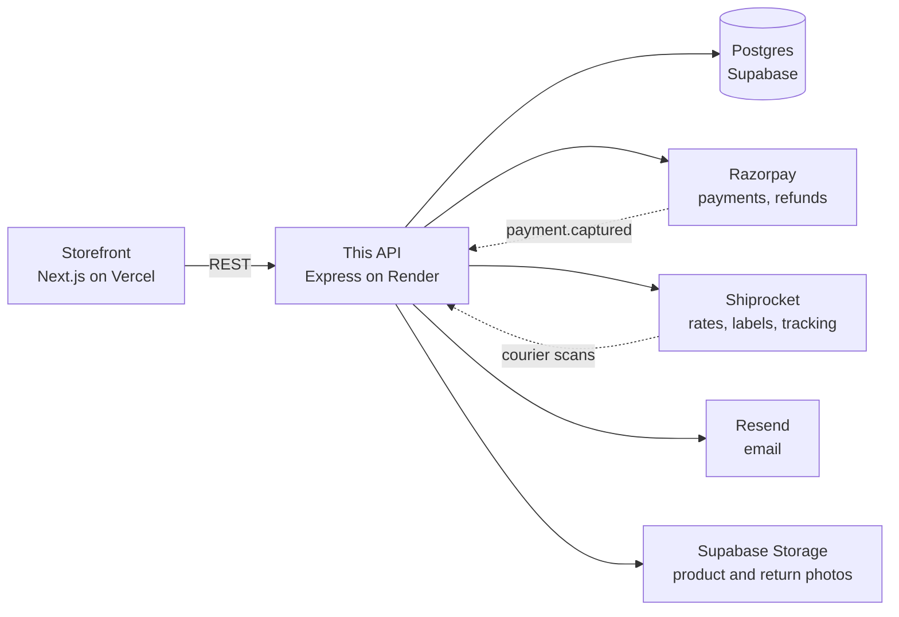
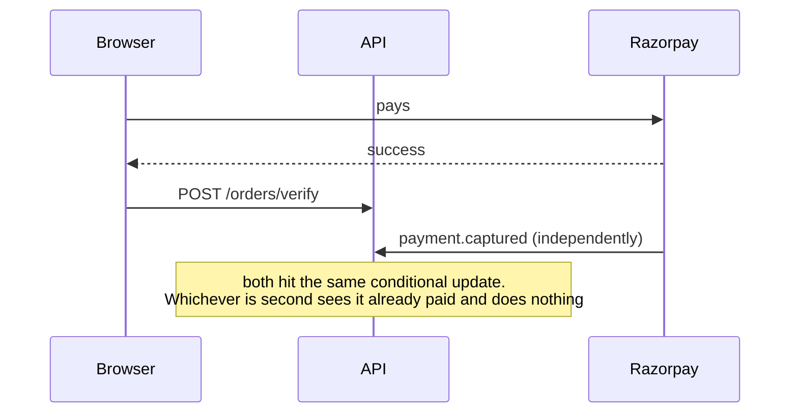
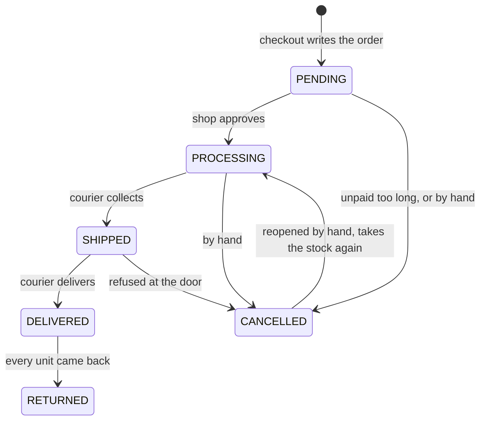
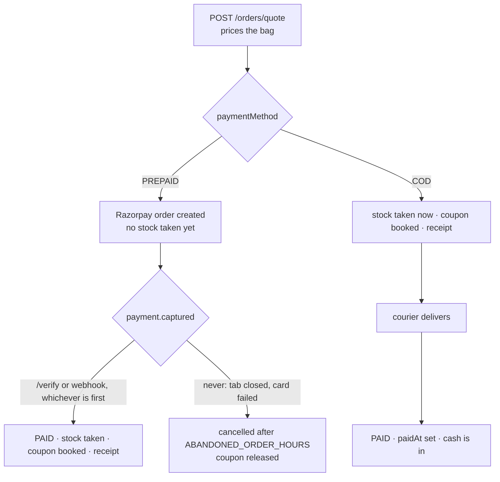
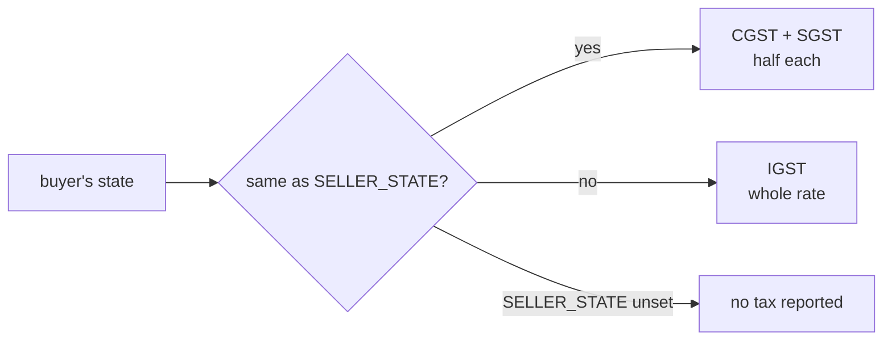
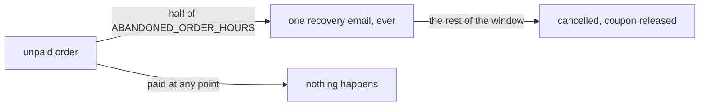
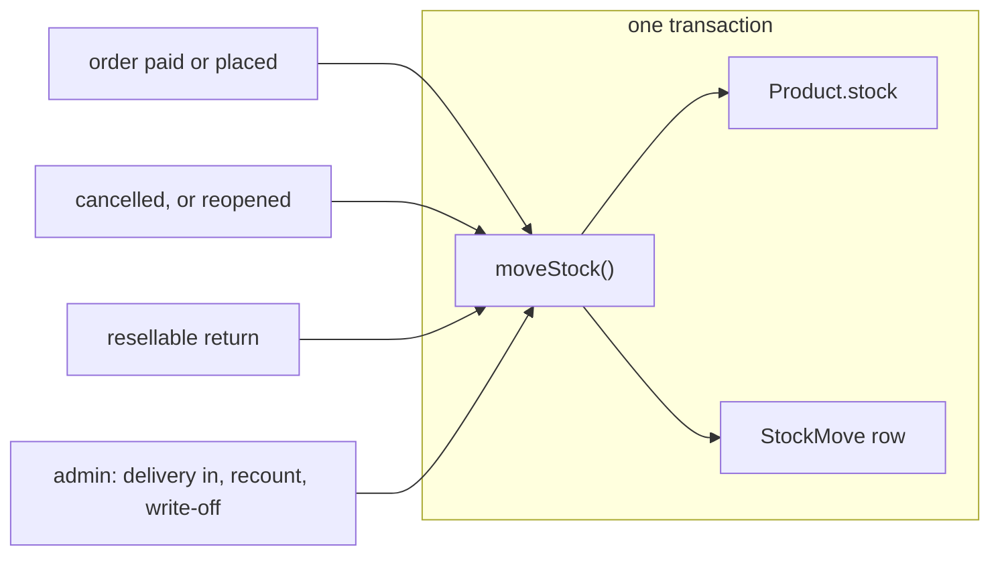
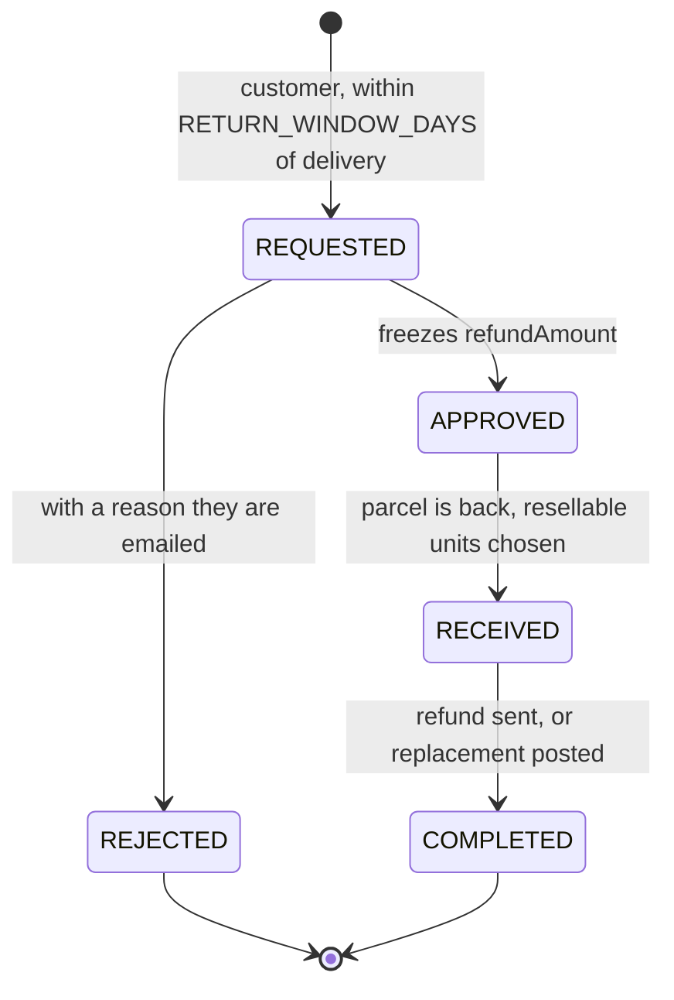

# Shukarsh Backend

The API behind the Shukarsh store: catalogue, checkout, payments, courier
booking, returns and reviews. Express and TypeScript, Prisma over Postgres.



The dotted arrows arrive on their own, and they are why the shop still works when
a customer closes the tab mid-payment or a parcel is delivered at 6am on a Sunday.
Everything except Postgres is optional: with no Razorpay, Shiprocket, Resend or
Supabase keys the store still runs, and each feature switches itself off rather
than erroring.

### Where to look

| If you want to | Go to |
| --- | --- |
| Run it on your machine | [Getting started](#getting-started) |
| Know what a setting does | [Settings](#settings) |
| Deploy it, or change the database | [Deployment](#deployment) · [Schema changes](#schema-changes) |
| Understand what happens after "Pay" | [An order's life](#an-orders-life) |
| Charge tax, or run a discount | [GST](#gst) · [Coupons](#coupons) |
| Send something back | [Returns](#returns) |
| Count what is on the shelf | [Stock](#stock) |
| Get a parcel to a customer | [What delivery costs](#what-delivery-costs-the-customer) · [Shiprocket](#shiprocket) |

## Getting Started

```bash
npm install
cp .env.example .env          # then fill in DATABASE_URL and JWT_SECRET
npx prisma migrate dev        # create the schema
npx prisma db seed            # optional sample catalogue
npm run dev                   # http://localhost:5000
```

`DATABASE_URL` and `JWT_SECRET` are the only two you need to get a server up.
Everything else turns a feature on.

## Scripts

| Command | What it does | Needs a database |
| --- | --- | --- |
| `npm run dev` | Dev server, reloads on save | yes |
| `npm run build` | Compile TypeScript | no |
| `npm run start` | Migrate, then serve the build | yes |
| `npm run lint` | ESLint over the repo | no |
| `npm run check:tax` | Asserts the GST, discount, delivery, COD and refund arithmetic against worked examples | no |
| `npm run check:stock` | Every product against the sum of its stock ledger | yes |
| `npm run check:emails` | Addresses that differ only by case | yes |
| `npm run rates:survey` | Real courier rates across 33 pincodes, with median and p90 | no, but needs Shiprocket credentials |
| `npm run db:migrate` | Apply migrations | yes |
| `npm run db:studio` | Browse the data | yes |

> [!TIP]
> `check:tax` needs nothing but the code, so it belongs in any pre-push habit.
> The three that need a database are diagnostics you run when something looks
> wrong, not part of the build.

## Settings

Every setting is an environment variable, and every one has a working default
except the two below. A feature whose keys are missing switches itself off; it
does not fail a request.

**Required**

| Setting | What it does |
| --- | --- |
| `DATABASE_URL` | Postgres connection string, from Supabase |
| `JWT_SECRET` | Signs sign-in tokens, and the recovery links in email |

> [!WARNING]
> `JWT_SECRET` has a hardcoded fallback so a fresh clone runs. Anyone who reads
> this repo can mint an admin token against a server that never set it.

**Payments**

| Setting | Default | What it does |
| --- | --- | --- |
| `RAZORPAY_KEY_ID`, `RAZORPAY_KEY_SECRET` | unset | Online payments and refunds. Unset means cash on delivery only |
| `RAZORPAY_WEBHOOK_SECRET` | unset | Verifies `payment.captured`. Without it the webhook is refused |
| `COD_ENABLED` | on | Set to `false` to take cash off the checkout |
| `COD_FEE` | `49` | Added to a cash order, and taxed like delivery |
| `COD_MAX` | `3000` | Most the courier may collect, fee included |

**Tax**

| Setting | Default | What it does |
| --- | --- | --- |
| `SELLER_STATE` | unset | Turns GST on, and decides CGST+SGST against IGST |
| `SELLER_GSTIN` | unset | Printed on invoices |
| `GST_DEFAULT_RATE` | `5` | Rate for a product that has none of its own |
| `GST_ON_SHIPPING` | on | `false` leaves delivery untaxed |
| `GST_ENABLED` | on | `false` overrides the above and reports no tax at all |

**Delivery**

| Setting | Default | What it does |
| --- | --- | --- |
| `SHIPPING_FREE_ABOVE` | `299` | Order value, after coupons, at which delivery is free |
| `SHIPPING_FLAT_FEE` | `0` | Charged below that. `0` means delivery is always free |
| `SHIPPING_MAX_ETD_DAYS` | `7` | Slowest courier we will book |
| `SHIPROCKET_EMAIL`, `SHIPROCKET_PASSWORD` | unset | API user, not your dashboard login |
| `SHIPROCKET_PICKUP_LOCATION` | unset | Pickup nickname, matched exactly |
| `SHIPROCKET_PICKUP_PINCODE` | unset | Where parcels are collected from |
| `SHIPROCKET_CHANNEL_ID` | unset | Which Shiprocket channel orders land in |
| `SHIPROCKET_WEBHOOK_TOKEN` | unset | Shared secret for courier status pushes |
| `TRACKING_SYNC_INTERVAL_MIN` | off | In-process poller, for an always-on host |
| `TRACKING_SYNC_MIN_GAP_SEC` | `300` | Cooldown on manual tracking refreshes |
| `CRON_SECRET` | unset | Lets an outside scheduler `POST /api/logistics/sync` |

**Everything else**

| Setting | Default | What it does |
| --- | --- | --- |
| `RESEND_API_KEY`, `EMAIL_FROM` | unset | Email. Both needed, or nothing is sent |
| `EMAIL_REPLY_TO` | `EMAIL_FROM` | Where replies go |
| `SUPABASE_URL`, `SUPABASE_SERVICE_ROLE_KEY` | unset | Image uploads |
| `SUPABASE_BUCKET` | `product-images` | Bucket for product and return photos |
| `FRONTEND_URL` | `https://shukarsh.com` | Used to build links inside emails |
| `CORS_ORIGIN` | `http://localhost:3000` | Who may call this API from a browser |
| `PORT` | `5000` | Listen port |
| `ABANDONED_ORDER_HOURS` | `24` | Unpaid checkout is cancelled after this |
| `RETURN_WINDOW_DAYS` | `7` | How long after delivery a return can be opened |
| `LOW_STOCK_DIGEST_HOUR` | `9` | Hour, IST, for the reorder email |
| `RATE_LIMIT_LOGIN_MAX` | `10` | Per IP, per window |
| `RATE_LIMIT_REGISTER_MAX` | `5` | |
| `RATE_LIMIT_QUOTE_MAX` | `300` | |
| `RATE_LIMIT_COUPON_MAX` | `20` | |
| `RATE_LIMIT_REVIEW_MAX` | `30` | |
| `RATE_LIMIT_UPLOAD_MAX` | `30` | |
| `RATE_LIMIT_RECOVERY_MAX` | `20` | |

<details>
<summary>Timeouts and base URLs, only worth touching to point at a mock</summary>

`RAZORPAY_API_BASE_URL` (`https://api.razorpay.com`),
`RAZORPAY_REQUEST_TIMEOUT_MS` (`20000`),
`SHIPROCKET_API_BASE_URL` (`https://apiv2.shiprocket.in`),
`SHIPROCKET_REQUEST_TIMEOUT_MS` (`15000`),
`SHIPROCKET_RATE_CACHE_TTL_SEC` (`900`),
`EMAIL_REQUEST_TIMEOUT_MS` (`10000`).

</details>

## Deployment

### Supabase Database

1. Create a free project at [supabase.com](https://supabase.com).
2. Go to Settings > Database > Connection string.
3. Copy the **URI** connection string.
4. Set it as `DATABASE_URL` in Render and locally.

### Schema changes

To change the schema, edit `prisma/schema.prisma`, then:

```bash
npx prisma migrate dev --name what_changed
```

Commit the generated folder under `prisma/migrations` along with the schema.

> [!CAUTION]
> Never run `prisma db push` against production. It changes the database without
> recording a migration, so the next deploy has no idea what has already been
> applied.

<details>
<summary>Why migrations run at boot, and why a failed one takes the server down</summary>

`prisma migrate deploy` runs from `prestart`, so it happens on the way up however
the host's build command is configured. `render.yaml` also puts it in
`buildCommand`, but a service created by hand in the Render dashboard does not use
the blueprint, and the schema silently not migrating is how new code ends up live
against an old database. Running it twice costs nothing: an applied migration is a
no-op.

So a failed migration stops the server from starting, which is the point. Refusing
to boot is easier to spot and fix than booting and throwing P2022 on every request
that touches the changed table.

</details>

### Render

1. Push this repo to GitHub.
2. In Render, click **New Web Service** and connect this repo.
3. Use the `render.yaml` blueprint or configure manually:
   - Build command: `npm install; npm run build`
   - Start command: `npm run start`
4. Set the environment variables from [Settings](#settings). To be selling, that
   means `DATABASE_URL`, `JWT_SECRET`, the two Razorpay keys, and `FRONTEND_URL`
   and `CORS_ORIGIN` pointing at your Vercel domain.

### Razorpay

1. Create a Razorpay account at [razorpay.com](https://razorpay.com).
2. Get your test key id and key secret from the dashboard.
3. Set `RAZORPAY_KEY_ID` and `RAZORPAY_KEY_SECRET` in your environment variables.
4. Use Razorpay test cards for testing, e.g., `5267 3181 8797 5449`.

#### Payment webhook

> [!WARNING]
> Set this up. The browser calls `/api/orders/verify` after a payment, but that call
> never happens if the customer closes the tab or loses signal in that moment.
> Razorpay would have taken the money while the order sat on `PENDING` with the stock
> never decremented.

1. Razorpay dashboard > **Settings > Webhooks > Add New Webhook**.
2. URL: `https://your-api-host/api/orders/webhook`
3. Secret: any long random string, also set as `RAZORPAY_WEBHOOK_SECRET`.
4. Subscribe to **payment.captured**.



## How the shop works

### An order's life

A status only ever moves forward, and `CANCELLED` and `RETURNED` are final, so a
courier scan that arrives a day late cannot reopen a closed order.



Payment is a separate axis, and this is where the two ways of paying part company.



| | Prepaid | Cash on delivery |
| --- | --- | --- |
| Stock is taken | when the payment lands | when the order is placed |
| Coupon redemption booked | at payment | at placement |
| `paidAt` set | at payment | at delivery |
| Abandoned sweep | cancels it, and the nudge email | skips it entirely |
| Dispatch allowed | once paid | straight away |
| Extra charge | none | `COD_FEE`, taxed like delivery |
| Refund | Razorpay, one button | UPI by hand, reference recorded |

Cash is on unless `COD_ENABLED` is the string `false`, adds `COD_FEE` (49), and is
refused above `COD_MAX` (3000) counted on the collectable amount with the fee in
it. Over the cap the quote does not fail: it prices as prepaid and returns
`codError`, so the page can explain itself.

<details>
<summary>Why the cap is on the collectable amount, and why cash orders take stock early</summary>

The cap is judged on the whole sum at risk at the door rather than the value of
the goods, because a refused parcel costs the shop both legs of shipping and
returns stock that may no longer be sellable.

Taking stock at placement looks eager, but for a cash order no payment is ever
coming before dispatch, so the alternative is shipping units the catalogue still
thinks are for sale. That also means cancelling has to give them back, which is
why `applyOrderStatus` asks whether the order *holds* stock rather than whether it
is paid. Four places used to test `paymentStatus === "PAID"` and all four were
wrong for cash: stock, dispatch, the abandoned sweeps, and revenue reporting,
which reads `paidAt`.

Delivery is what sets `paidAt` on a cash order because that is when the money
exists. The courier's remittance arrives later, but the sale happened at the door.

</details>

<details>
<summary>Why a cash refund cannot go back the way it came</summary>

There is no payment to reverse. `POST /returns/:id/refund/manual` records a
payment the shop already made over UPI, storing the reference in the same unique
column as a Razorpay refund id, and refuses any order that has a
`razorpayPaymentId` so nothing is refunded twice. A whole-order return refunds the
collection fee along with delivery, on the same all-or-nothing rule.

</details>

### GST

> [!IMPORTANT]
> Listed prices are the MRP: **the tax is already inside them**. Nothing here
> changes what a customer is charged. It decides how the tax already in the total
> is reported on the order, the receipt and the invoice.



| | Rate used |
| --- | --- |
| A product | its own `gstRate`, from the real slabs: 0, 0.25, 3, 5, 12, 18, 28 |
| A product with none set | `GST_DEFAULT_RATE` |
| Delivery | the rate of the highest-value item, unless `GST_ON_SHIPPING=false` |
| The COD fee | the same, because it rides on the principal supply |

`POST /api/orders/quote` prices a bag without writing anything down, and the
checkout page uses it, so the GST a customer sees comes from the code that charges
the card.

<details>
<summary>Why GST stays off until you set a state, and why old invoices never change</summary>

`SELLER_STATE` is what splits CGST+SGST from IGST, so there is nothing sensible to
report without it. That is also the right setting until you hold a GSTIN, because
charging GST without one is not legal.

Every order stores its own tax breakdown and the rate that applied to each line at
the time. Slabs change and customers move house, and neither may rewrite an invoice
that has already gone out. `placeOfSupply` is kept for the same reason: GSTR-1 is
filed state-wise.

Shiprocket is sent `tax: 0` on every line on purpose. Our `selling_price` is
already inclusive and Shiprocket adds `tax` on top when it prints an invoice, so
any other value bills the customer's GST to them twice.

</details>

### Coupons

Managed under **Admin > Coupons**. Three kinds: a percent off (optionally capped),
a flat amount off, or free shipping. Each code can carry a minimum spend, a total
usage limit, a per-customer limit, a live window, and a first-order-only flag.

| Behaviour | Rule |
| --- | --- |
| Scope | No categories or products attached means the whole catalogue. Attach some and only those lines are discounted |
| Minimum spend | Measured against the covered lines, not the whole bag |
| How it is split | In proportion to what each covered line is worth, before tax |
| When a use is counted | At payment, not at checkout |
| Per-customer limit | Counts unpaid checkouts as well as paid ones |
| Overshoot | A busy limited code can exceed `usageLimit` by a use or two under concurrent checkouts |
| Deleting a used code | Switches it off instead |

`POST /api/coupons/apply` checks a code against a real bag and is what the checkout
calls. It runs the whole quote rather than reading the coupon on its own, so the
figure it reports is the figure that will be charged.

<details>
<summary>Why the split matters, and why a use is counted at payment</summary>

Splitting in proportion is not cosmetic: GST is charged per line at that line's own
rate, so which lines the money comes off changes what is owed. The discount lands
before tax is worked out, because GST is due on what the customer actually pays.

Redemptions are booked when an order is confirmed so an abandoned checkout never
eats into the total count, and the count is then incremented unconditionally: the
money has been taken, and refusing to record it would leave a discount charged but
unaccounted for. The per-customer limit has to count unpaid checkouts too, or five
of them carrying a one-per-person code can all be paid afterwards.

`usageLimit` is checked when the code is applied and again before payment starts,
which is everywhere it can still be honoured. Deleting a used code would cascade
its redemptions away, and those are what evidence an order's discount.

</details>

#### Abandoned checkouts



The sweep runs hourly in process and again on `POST /api/logistics/sync`, which is
the clock a host that sleeps actually has. It only touches orders Razorpay never
named a payment against, and it skips cash orders entirely. The email is recorded
on `Order.recoveryEmailAt` so there is never a second one, and it is skipped for a
customer who has paid for anything since, because a card that fails once often
succeeds on the retry.

<details>
<summary>How a recovery link works without signing in</summary>

The link carries an HMAC of the order id, so it cannot be made up from an order id
alone. `GET /api/orders/:id/recover` returns nothing but the products and
quantities, and only those still on sale. The bag lives in the customer's browser,
so the link rebuilds it rather than reviving the old checkout: prices, stock,
delivery and coupons are all worked out again at the till.

</details>

### Email

Order confirmations and dispatch notices go out through
[Resend](https://resend.com) over its REST API, so there is no SDK to install.
Set `RESEND_API_KEY` and `EMAIL_FROM` (a sender on a domain you have verified
with Resend). Leave them unset and the store behaves exactly as before, just
without email. A send that fails is logged and never blocks a payment or a
shipment.

### Accounts

One address is one account, however it was typed. Every route that takes an email
parses it through `emailField`, which trims and lowercases before validating, so
what gets stored is what the next sign-in will search for.

> [!NOTE]
> There is still work owed here. Once `npm run check:emails` reports nothing, add a
> unique index on `lower("email")` to make the rule structural. It is not there yet
> because creating it fails while any duplicate exists, and a failed migration is a
> failed deploy.

<details>
<summary>What the migration did, and what it deliberately would not do</summary>

Sign-in used to compare addresses exactly, which made `Priya@gmail.com` and
`priya@gmail.com` two people with their orders split between them. The migration
lowercased every address that could be lowercased without landing on another row,
and stopped at pairs that differ only by case, because merging two accounts means
choosing whose orders and whose password survive. That is a decision for a person.

`check:emails` lists the ones left with order counts, to show which is the real one.
Sign-in still reaches those rows through a case-insensitive fallback, oldest first,
and quietly rewrites the address to lowercase once its owner has proved it is theirs.

</details>

### Stock

Two numbers, one truth. `Product.stock` decides whether something can be sold,
because the conditional decrement on it is what stops two people buying the same
last item. `StockMove` is the ledger beside it, so a quantity nobody expects can be
explained instead of argued about.



Everything goes through `moveStock()` in `src/lib/inventory.ts`, in the same
transaction as whatever caused it, so the shelf and the reason for it can never
disagree.

| Reason | Written when |
| --- | --- |
| `INITIAL` | Product created, or given an opening balance by the ledger's migration |
| `SALE` | Prepaid order paid, or cash order placed |
| `CANCELLATION` | Order called off, units back |
| `REOPEN` | Cancelled order restarted, units taken again |
| `RETURN_RESTOCK` | Returned parcel judged sellable |
| `RECEIVED` | New stock arrived |
| `CORRECTION` | Counted the shelf and the number was wrong |
| `DAMAGE` | Broken, lost or written off |

Each product carries its own `lowStockThreshold` (5 by default), which drives the
catalogue badge, the dashboard count, the "only a few left" line on the storefront,
and a digest email at `LOW_STOCK_DIGEST_HOUR`.

> [!IMPORTANT]
> Admin adjustments post a **difference**, never a total. A form that says "there
> are now 12" throws away any sale made while it was open;
> `POST /api/products/:id/stock` takes `delta` and cannot. The product form still
> accepts an absolute number and records the difference as a `CORRECTION`.

<details>
<summary>Checking the ledger, and why the digest cannot send four times</summary>

`npm run check:stock` compares every product against the sum of its moves and
exits non-zero on any disagreement. It needs a database, so it is a diagnostic
rather than part of the build.

The day the low-stock digest last ran is kept in `SystemFlag`, because a host that
redeploys or wakes from sleep would otherwise send the same list on every boot.

</details>

### Returns



| Rule | Where it comes from |
| --- | --- |
| Window opens at delivery | `Order.deliveredAt`, written the first time an order is seen delivered and never moved |
| Two reasons only, damaged or wrong item | Nails and kitchen pieces cannot be resold once opened |
| A damage claim needs a photo | Uploaded to `POST /api/uploads/returns`, signed-in customers, `returns/` prefix |
| What it is worth is frozen on approval | `refundAmount`, apportioned from what was actually paid |
| Delivery comes back only if nothing is kept | And the COD fee with it |
| Only resellable units return to stock | Asked per item when the parcel is marked received |
| A return covering every unit | Also moves the order itself to `RETURNED` |

Sending the money is its own button, `POST /api/returns/:id/refund`, not part of
closing the return. Pressing it twice cannot pay twice: the return id goes out as
`X-Refund-Idempotency` so Razorpay hands back the original refund, and
`ReturnRequest.refundId` is unique so the database refuses a second one anyway. A
failure is recorded in `refundError`, shown in the queue, and the button stays.

> [!NOTE]
> Reverse pickup is still manual. Book it in the Shiprocket dashboard.

<details>
<summary>Why a photo URL is not evidence until we check it</summary>

The browser decides what to send, so an arbitrary URL on the request proves
nothing. What comes back is checked against the `returns/` prefix in our own
Supabase bucket on the way in, and there is no customer-facing delete, so nothing
can vanish halfway through a decision. Uploads are rate limited by
`RATE_LIMIT_UPLOAD_MAX` and need a signed-in account rather than an admin.

</details>

<details>
<summary>Why the refund is apportioned rather than the sticker price</summary>

`OrderItem.taxableAmount + taxAmount` is the line net of its share of any coupon.
Refunding the sticker price on one dress out of three when the bag had ₹300 off
would hand back a third of that discount twice. GST is charged per line at that
line's own rate, so which line the money comes off changes what is owed.
`npm run check:tax` asserts all of it, and orders delivered before `deliveredAt`
existed have no date to count from, so they are handed to a human rather than
refused.

</details>

### Reviews

Only customers the shop has delivered to can write one. This is not a badge
added afterwards: `POST /api/reviews` looks for an order belonging to the caller
that is `DELIVERED` and contains that product, and refuses without one. So every
row in the table is a real purchase, and there is no unverified case to display.
Delivered rather than merely paid, because a review written while the parcel is
still in a van is about the courier.

One review per person per product (`@@unique([userId, productId])`), so posting
again edits the existing one. `GET /api/reviews/mine?productId=` tells the form
whether the shopper is eligible before it renders, and returns their own review
including its hidden state.

The shop can hide a review, never delete it, and only with a reason:
`POST /api/reviews/:id/hide` with `{ reason }` stores `hiddenAt` and
`hiddenReason`, and `unhide` reverses it. Hidden rows are filtered inside the
query, so they are out of both the public list and the average. Editing a hidden
review does not put it back up.

> [!CAUTION]
> Take down abuse, spam, and anything naming a third party. Do not take down a fair
> complaint. Hiding poor ratings leaves an average that lies to shoppers, and it is
> what disqualifies the shop from showing stars in Google results, which is the only
> reason the aggregate is published as structured data at all. The reason field is
> mandatory to make that a decision somebody has to write down.

Shopper-facing product reads carry `rating: { count, average }`, averaged by the
database over visible reviews and rounded to one decimal. Admin writes leave the
field off entirely rather than sending a zero, since absent means "not counted here"
and zero would read as "nobody likes this".

### What delivery costs the customer

The shop's own policy, not the courier's rate: free at or above
`SHIPPING_FREE_ABOVE` (299 by default) of order value after any coupon, and
`SHIPPING_FLAT_FEE` (0 by default) below it. So delivery is free everywhere until
a fee is configured.

Since the shop pays for delivery, it also books it: the cheapest courier promising
delivery within `SHIPPING_MAX_ETD_DAYS` (7 by default). An admin picking a courier
by hand on the order overrides that.

<details>
<summary>Why the customer never sees a courier rate, and where the numbers come from</summary>

A live courier rate has two customers paying different amounts for the same dress
because one lives further away, it publishes what the shop pays to anyone with a
pincode, and it makes the total depend on Shiprocket answering. Under a flat policy
an outage costs a delivery estimate, not the fee.

What the courier actually charges is still worth knowing before moving these
numbers: `npm run rates:survey` quotes real rates across 33 pincodes and prints the
median and p90 to set them from. We do not take Shiprocket's `recommended` courier,
which is chosen on rating and ran ₹57 over the cheapest on a median parcel.

</details>

### Shiprocket

Shipping is optional. With no Shiprocket credentials set the store still takes
orders, charges the same policy fee and simply cannot estimate a delivery date,
so you can launch before the courier account is approved.

1. Add a pickup address under **Settings > Pickup Addresses** and note its
   nickname and pincode.
2. Create an API user under **Settings > API > Configure**. This is a separate
   credential from your dashboard login.
3. Set `SHIPROCKET_EMAIL`, `SHIPROCKET_PASSWORD`, `SHIPROCKET_PICKUP_LOCATION`
   (the nickname, matched exactly) and `SHIPROCKET_PICKUP_PINCODE`.
4. Generate a long random `SHIPROCKET_WEBHOOK_TOKEN`, then under
   **Settings > API > Webhooks** point the status webhook at
   `https://your-api-host/api/logistics/webhook` and paste the same token as the
   `x-api-key` value.

Auth tokens are cached for nine days and refreshed automatically on a 401, so
normal traffic costs no extra login calls.

A cash order is sent as `payment_method: COD` with `transaction_charges` derived
from the collectable amount, so Shiprocket's own arithmetic lands on exactly the
figure the customer was told to keep ready.

#### Orders that move themselves

Once a shipment has an AWB, courier scans drive the order status with no clicking.
Two things do it, and the second exists because the first is not reliable.

| Route | Good for | Cost |
| --- | --- | --- |
| Courier webhook | Instant, no polling | Silently drops updates, and cannot reach a sleeping service |
| Poller | Catches whatever the webhook lost | One courier call per active shipment |
| **Refresh tracking** button | An admin who wants to know now | Shares a cooldown, `TRACKING_SYNC_MIN_GAP_SEC` (300s) |

Run the poller whichever way the host allows:

- **Always-on host:** set `TRACKING_SYNC_INTERVAL_MIN` to something like `30`.
- **Host that sleeps, or a separate scheduler:** set `CRON_SECRET` and have a cron
  job `POST /api/logistics/sync` with an `x-cron-key` header. This path ignores the
  cooldown and always does the work.

> [!NOTE]
> This repo runs on Render's free tier, where the service sleeps. In-process timers
> do not fire while it is asleep, so the cron route is the only clock that works
> there. Until one is set up, tracking only advances when somebody opens the admin
> orders page.

#### Logistics endpoints

| Method | Path | Access | Purpose |
| --- | --- | --- | --- |
| GET | `/api/logistics/config` | Public | Delivery policy, and whether live shipping is on |
| POST | `/api/logistics/rates` | Public | Delivery fee and estimate for a cart and pincode |
| GET | `/api/logistics/pincode/:pincode` | Public | City and state autofill |
| GET | `/api/logistics/pickup-locations` | Admin | Pickup nicknames as Shiprocket sees them |
| GET | `/api/logistics/orders/:id/rates` | Admin | Courier options for a placed order |
| POST | `/api/logistics/orders/:id/ship` | Admin | Create the shipment, assign an AWB, make the label |
| POST | `/api/logistics/orders/:id/pickup` | Admin | Schedule a courier pickup |
| POST | `/api/logistics/orders/:id/invoice` | Admin | Generate the invoice PDF |
| POST | `/api/logistics/orders/:id/manifest` | Admin | Generate the manifest PDF |
| POST | `/api/logistics/orders/:id/cancel-shipment` | Admin | Cancel an assigned AWB |
| GET | `/api/logistics/orders/:id/track` | Owner or admin | Live tracking for one order |
| POST | `/api/logistics/webhook` | Token | Courier status pushes |
